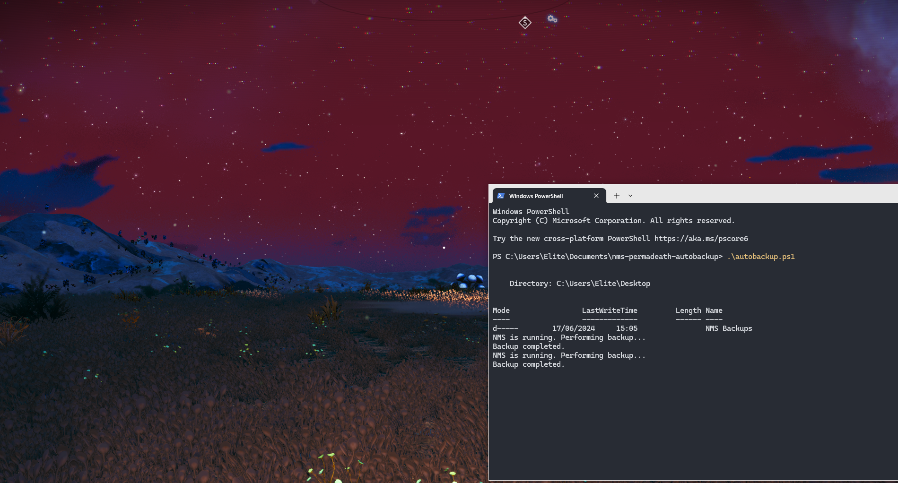

# Automatic Backup Script for No Man's Sky

## Description

This PowerShell script automatically backs up No Man's Sky (NMS) game data every 5 minutes as long as the game is running. If the game is not detected as running for two consecutive checks, the script stops.

## Features

- **Game State Detection**: The script checks if the game process is running.
- **Automatic Backup**: Copies NMS save files to a specified destination folder.
- **Check Intervals**: Checks the game's state every 5 minutes and performs a backup if the game is running.
- **Conditional Stop**: Stops the script if the game is not detected as running for two consecutive checks.

## Prerequisites

- Windows PowerShell
- No Man's Sky installed
- Read/write access to NMS save game folders

## Usage

1. **Download the script**.
2. **Start NMS game**
3. **Open PowerShell** as an administrator.
4. **Run the script** using the following command:
   ```powershell
   .\autobackup.ps1
   ```



## Contribution

Contributions are welcome! If you have suggestions or improvements, feel free to open an issue or submit a pull request.
